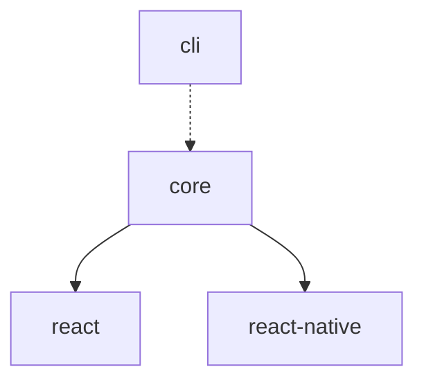

# Contributing to Python React ML

We're excited that you're interested in contributing to Python React ML! This document outlines the process for contributing to this project.

## 📋 Table of Contents

- [Code of Conduct](#code-of-conduct)
- [Getting Started](#getting-started)
- [Development Setup](#development-setup)
- [Project Structure](#project-structure)
- [Development Workflow](#development-workflow)
- [Testing](#testing)
- [Pull Request Process](#pull-request-process)
- [Release Process](#release-process)

## 📜 Code of Conduct

This project adheres to a Code of Conduct. By participating, you are expected to uphold this code. Please be respectful and constructive in all interactions.

## 🚀 Getting Started

### Prerequisites

- Node.js (16.0.0 or higher)
- npm (7.0.0 or higher)
- Git
- Python 3.11+ (for testing Python models)

### Fork and Clone

1. Fork the repository on GitHub
2. Clone your fork locally:

```bash
git clone https://github.com/your-username/python-react-ml.git
cd python-react-ml
```

## ⚙️ Development Setup

### Install Dependencies

```bash
# Install all workspace dependencies
npm install

# Build all packages
npm run build
```

### Verify Setup

```bash
# Run type checking
npm run type-check

# Run linting
npm run lint

# Run tests
npm test
```

## 📁 Project Structure

```
python-react-ml/
├── packages/
│   ├── core/           # Core Python execution engine
│   ├── react/          # React hooks and components
│   ├── react-native/   # React Native bridge
│   └── cli/            # CLI tools
├── examples/           # Example applications
├── docs/              # Documentation
└── tools/             # Build and development tools
```

### Package Dependencies



## 🔄 Development Workflow

### Branch Naming

- `feature/your-feature-name` - New features
- `fix/issue-description` - Bug fixes
- `docs/documentation-update` - Documentation updates
- `chore/maintenance-task` - Maintenance tasks

### Making Changes

1. Create a feature branch:
```bash
git checkout -b feature/your-feature-name
```

2. Make your changes in the appropriate package(s)

3. Test your changes:
```bash
npm run build
npm test
```

4. Commit your changes:
```bash
git add .
git commit -m "feat: add your feature description"
```

### Commit Convention

We follow the [Conventional Commits](https://www.conventionalcommits.org/) specification:

- `feat:` - New features
- `fix:` - Bug fixes
- `docs:` - Documentation changes
- `style:` - Code style changes (formatting, etc.)
- `refactor:` - Code refactoring
- `test:` - Adding or updating tests
- `chore:` - Maintenance tasks

Examples:
```
feat(react): add useModel hook
fix(core): resolve memory leak in Python engine
docs: update installation instructions
test(cli): add bundle command tests
```

## 🧪 Testing

### Running Tests

```bash
# Run all tests
npm test

# Run tests for specific package
npm test --workspace=packages/core

# Run tests in watch mode
npm run test:watch
```

### Test Coverage

Maintain test coverage above 80%. Run coverage report:

```bash
npm run test:coverage
```

### Writing Tests

- Place test files next to source files with `.test.ts` extension
- Use descriptive test names
- Test both happy path and error cases
- Mock external dependencies appropriately

Example:
```typescript
// useModel.test.ts
import { renderHook } from '@testing-library/react-hooks';
import { useModel } from './useModel';

describe('useModel', () => {
  it('should load model successfully', async () => {
    const { result, waitForNextUpdate } = renderHook(() => 
      useModel('/test-model.bundle.zip')
    );
    
    expect(result.current.status).toBe('loading');
    
    await waitForNextUpdate();
    
    expect(result.current.status).toBe('ready');
    expect(result.current.model).toBeTruthy();
  });
});
```

## 🔍 Pull Request Process

### Before Submitting

1. Ensure all tests pass
2. Update documentation if needed
3. Add changeset if your changes affect the public API:

```bash
npx changeset
```

4. Ensure your code follows the project's style guidelines

### PR Description Template

```markdown
## Description
Brief description of what this PR does.

## Type of Change
- [ ] Bug fix (non-breaking change which fixes an issue)
- [ ] New feature (non-breaking change which adds functionality)
- [ ] Breaking change (fix or feature that would cause existing functionality to not work as expected)
- [ ] Documentation update

## Testing
- [ ] Tests pass locally
- [ ] Added/updated tests for changes
- [ ] Manual testing completed

## Checklist
- [ ] Code follows style guidelines
- [ ] Self-review completed
- [ ] Documentation updated
- [ ] No merge conflicts
```

### Review Process

1. Automated checks must pass (CI/CD)
2. At least one maintainer approval required
3. Address all review feedback
4. Keep PR focused and reasonably sized
5. Rebase if requested to maintain clean history

## 📦 Release Process

Releases are handled by maintainers using Changesets:

1. Changes accumulate as changesets
2. Version bump PR is created automatically
3. Maintainer merges version bump PR
4. Packages are automatically published to npm

### Creating a Changeset

When making changes that affect the public API:

```bash
npx changeset
```

Follow the prompts to:
- Select affected packages
- Choose version bump type (patch/minor/major)
- Describe the changes

## 🛠️ Development Tips

### Hot Reloading

For active development:

```bash
# Watch mode for TypeScript compilation
npm run dev --workspace=packages/core

# Run example with hot reload
npm run dev:react-example
```

### Debugging

- Use `console.log` for simple debugging
- Use browser devtools for React components
- Use Node.js debugger for CLI tools
- Add debug logs to Python worker for Pyodide issues

### Working with Pyodide

When working on the core Python engine:

- Test with small Python snippets first
- Check Pyodide compatibility for new packages
- Monitor memory usage in web workers
- Handle async operations carefully

## 🚨 Common Issues

### Build Issues

**TypeScript errors in packages:**
```bash
# Clean build cache
npm run clean
npm run build
```

**Module resolution errors:**
```bash
# Reinstall dependencies
rm -rf node_modules package-lock.json
npm install
```

### Testing Issues

**Tests failing after changes:**
```bash
# Update snapshots if needed
npm test -- --updateSnapshot

# Clear test cache
npm test -- --clearCache
```

## 📞 Getting Help

- **GitHub Discussions**: Ask questions and share ideas
- **GitHub Issues**: Report bugs or request features  
- **Discord**: Join our community chat (link in README)
- **Email**: maintainers@python-react-ml.dev

## 🎯 Good First Issues

Look for issues labeled `good-first-issue` or `help-wanted`:

- Documentation improvements
- Example applications
- Test coverage improvements
- CLI usability enhancements
- Error message improvements

Thank you for contributing to Python React ML! 🎉