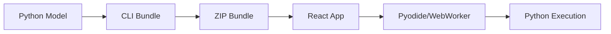

# Python React ML

> **Production-Grade Edge AI Infrastructure**. Run Python ML models in React with resilient worker orchestration, smart caching, and web-native performance.

[](https://badge.fury.io/js/@python-react-ml%2Fcore)
[](https://opensource.org/licenses/MIT)

## 🚀 Features

- **Resilient Worker Orchestration**: Auto-healing workers that restart on crash (OOM) and retry failed inferences.
- **Smart Caching Layer**: Zero-latency model loading via IndexedDB with ETag/Hash validation.
- **Multi-Runtime Support**: Choose between Pyodide (Python), ONNX Runtime, or TensorFlow.js
- **Python in the Browser**: Run real Python code client-side using Pyodide WebAssembly
- **ONNX Models**: High-performance inference with ONNX Runtime Web
- **TensorFlow.js Integration**: Native TensorFlow.js model support with GPU acceleration
- **React Integration**: Seamless hooks and components for React apps
- **React Native Support**: Native bridge for mobile applications
- **Offline-First**: No internet required after initial model load
- **TypeScript**: Full TypeScript support for better DX

## 📋 Table of Contents

- [Installation](#installation)
- [Quick Start](#quick-start)
- [Runtime Selection](#runtime-selection)
- [Packages](#packages)
- [Usage](#usage)
  - [React Web](#react-web)
  - [React Native](#react-native)
  - [CLI Tools](#cli-tools)
- [API Reference](#api-reference)
- [Examples](#examples)
- [Contributing](#contributing)
- [License](#license)

## 🔧 Installation

### For React Web Projects

```bash
npm install @python-react-ml/core @python-react-ml/react
```

### For React Native Projects

```bash
npm install @python-react-ml/core @python-react-ml/react-native

# iOS additional setup
cd ios && pod install
```

### CLI Tools

```bash
npm install -g @python-react-ml/cli
```

https://github.com/user-attachments/assets/b36381eb-06e1-426c-9923-5448ef104545

## 🚀 Quick Start

### 1. Create a Python Model

```python
# model.py
import numpy as np

def predict(input_data):
    """Main prediction function"""
    # Your ML model logic here
    features = np.array(input_data)
    # Simple linear model example
    result = np.sum(features) * 0.5
    return float(result)

def get_model_info():
    """Optional: Return model metadata"""
    return {
        "name": "My Model",
        "version": "1.0.0",
        "type": "regression"
    }
```

### 2. Bundle Your Model

```bash
python-react-ml bundle model.py -o my-model.bundle.zip
```

### 3. Use in React

```jsx
import { useModel } from '@python-react-ml/react';

function MyApp() {
  const { model, status, predict, error } = useModel('/my-model.bundle.zip');

  const handlePredict = async () => {
    if (model) {
      const result = await predict([1.0, 2.0, 3.0]);
      console.log('Prediction:', result);
    }
  };

  if (status === 'loading') return <div>Loading model...</div>;
  if (status === 'error') return <div>Error: {error}</div>;

  return (
    <div>
      <h1>Python ML in React!</h1>
      <button onClick={handlePredict} disabled={status !== 'ready'}>
        Run Prediction
      </button>
    </div>
  );
}
```

## � Runtime Selection

Python React ML supports multiple runtime engines to optimize for different model types and performance requirements:

### 🐍 Pyodide Runtime (Python)
**Best for**: Custom Python models, data preprocessing, complex ML pipelines

- Full Python environment with NumPy, SciPy, scikit-learn, and more
- Direct Python code execution in the browser via WebAssembly
- Support for custom Python packages and dependencies
- Ideal for models with complex preprocessing or custom logic

```jsx
import { useModel } from '@python-react-ml/react';

function PyodideExample() {
  const { model, predict, status } = useModel('/python-model.bundle.zip', {
    runtime: 'pyodide'  // Default runtime
  });
  
  // Your Python model.py will be executed directly
  return <div>Python Model Status: {status}</div>;
}
```

### ⚡ ONNX Runtime
**Best for**: High-performance inference, production models, cross-platform compatibility

- Optimized C++ inference engine compiled to WebAssembly
- Support for models exported from PyTorch, TensorFlow, scikit-learn
- Fastest inference performance with smaller bundle sizes
- Hardware acceleration support (GPU via WebGL)

```jsx
import { useModel } from '@python-react-ml/react';

function ONNXExample() {
  const { model, predict, status } = useModel('/model.onnx', {
    runtime: 'onnx'
  });
  
  const handlePredict = async () => {
    // Input as tensors - matches your ONNX model's input specification
    const result = await predict({
      input: new Float32Array([1.0, 2.0, 3.0, 4.0])
    });
    console.log('ONNX Result:', result);
  };

  return (
    <div>
      <p>ONNX Model Status: {status}</p>
      <button onClick={handlePredict}>Run Inference</button>
    </div>
  );
}
```

### 🧠 TensorFlow.js Runtime
**Best for**: TensorFlow models, neural networks, GPU acceleration

- Native TensorFlow.js execution with full ecosystem support
- Excellent GPU acceleration via WebGL backend
- Support for both SavedModel and GraphModel formats
- Ideal for neural networks and deep learning models

```jsx
import { useModel } from '@python-react-ml/react';

function TensorFlowExample() {
  const { model, predict, status } = useModel('/tfjs-model/', {
    runtime: 'tfjs',
    tfjsBackend: 'webgl'  // Use GPU acceleration
  });
  
  const handlePredict = async () => {
    // Input as tensor-compatible arrays
    const result = await predict([
      [[1.0, 2.0], [3.0, 4.0]]  // Shape depends on your model
    ]);
    console.log('TensorFlow.js Result:', result);
  };

  return (
    <div>
      <p>TensorFlow.js Model Status: {status}</p>
      <button onClick={handlePredict}>Run Inference</button>
    </div>
  );
}
```

### Runtime Comparison

| Runtime | Performance | Bundle Size | GPU Support | Model Types |
|---------|------------|-------------|-------------|-------------|
| **Pyodide** | Good | Large (~10MB+) | No | Python scripts, Custom ML |
| **ONNX** | Excellent | Small (~2-5MB) | Yes (WebGL) | Standard ML models |
| **TensorFlow.js** | Excellent | Medium (~5-8MB) | Yes (WebGL/WebGPU) | Neural networks, Deep learning |

### Choosing the Right Runtime

1. **Development/Prototyping**: Start with **Pyodide** for maximum flexibility
2. **Production Performance**: Use **ONNX** for fastest inference with smallest bundles
3. **TensorFlow Models**: Use **TensorFlow.js** for native TF model support and GPU acceleration
4. **Complex Pipelines**: Use **Pyodide** when you need full Python ecosystem features

## �📦 Packages

| Package | Description | Size |
|---------|-------------|------|
| [`@python-react-ml/core`](./packages/core) | Core Python execution engine |  |
| [`@python-react-ml/react`](./packages/react) | React hooks and components |  |
| [`@python-react-ml/react-native`](./packages/react-native) | React Native native bridge |  |
| [`@python-react-ml/cli`](./packages/cli) | CLI tools for bundling |  |

## � Migration Guide

### Upgrading to Multi-Runtime Support

If you're upgrading from a previous version, here's what changed:

#### Before (v1.x)
```jsx
import { useModel } from '@python-react-ml/react';

function MyApp() {
  // Only Pyodide runtime was available
  const { model, predict } = useModel('/model.bundle.zip');
  // ...
}
```

#### After (v2.0+)
```jsx
import { useModel } from '@python-react-ml/react';

function MyApp() {
  // Now you can specify runtime - Pyodide is still the default
  const { model, predict } = useModel('/model.bundle.zip', {
    runtime: 'pyodide'  // Explicit but optional for backward compatibility
  });
  
  // Or use new runtime engines for better performance
  const { model: onnxModel } = useModel('/model.onnx', {
    runtime: 'onnx'     // High-performance ONNX Runtime
  });
  
  const { model: tfModel } = useModel('/tfjs-model/', {
    runtime: 'tfjs',    // TensorFlow.js with GPU acceleration
    tfjsBackend: 'webgl'
  });
  // ...
}
```

#### Breaking Changes
- **None for existing Pyodide users**: Existing code continues to work unchanged
- **New dependencies**: ONNX Runtime Web and TensorFlow.js are now included (but tree-shaken if unused)
- **Bundle format**: New model formats supported (.onnx files, TensorFlow.js model directories)

#### New Features
- **Runtime selection**: Choose between `pyodide`, `onnx`, or `tfjs`
- **Performance options**: GPU acceleration, optimized inference engines  
- **Model format support**: ONNX (.onnx), TensorFlow.js (model.json + weights), Python bundles (.zip)

## �📚 Usage

### React Web

#### Basic Hook Usage

```jsx
import { useModel } from '@python-react-ml/react';

function ModelComponent() {
  const { model, status, predict, reload } = useModel('/path/to/model.bundle.zip', {
    runtime: 'pyodide'  // or 'onnx', 'tfjs'
  });

  return (
    <div>
      <p>Status: {status}</p>
      {status === 'ready' && (
        <button onClick={() => predict([1, 2, 3])}>
          Predict
        </button>
      )}
    </div>
  );
}
```

#### Multi-Runtime Examples

```jsx
import { useModel } from '@python-react-ml/react';

// Python model with Pyodide
function PythonModel() {
  const { model, predict, status } = useModel('/python-model.bundle.zip', {
    runtime: 'pyodide'
  });

  const handlePredict = async () => {
    const result = await predict([1.0, 2.0, 3.0]);
    console.log('Python result:', result);
  };

  return <button onClick={handlePredict}>Run Python Model</button>;
}

// ONNX model for high performance
function ONNXModel() {
  const { model, predict, status } = useModel('/model.onnx', {
    runtime: 'onnx'
  });

  const handlePredict = async () => {
    const result = await predict({
      input: new Float32Array([1.0, 2.0, 3.0, 4.0])
    });
    console.log('ONNX result:', result);
  };

  return <button onClick={handlePredict}>Run ONNX Model</button>;
}

// TensorFlow.js model with GPU acceleration
function TensorFlowModel() {
  const { model, predict, status } = useModel('/tfjs-model/', {
    runtime: 'tfjs',
    tfjsBackend: 'webgl'
  });

  const handlePredict = async () => {
    const result = await predict([
      [[0.1, 0.2], [0.3, 0.4]]
    ]);
    console.log('TensorFlow.js result:', result);
  };

  return <button onClick={handlePredict}>Run TF.js Model</button>;
}
```

#### Provider Pattern

```jsx
import { PythonModelProvider, useModelContext } from '@python-react-ml/react';

function App() {
  return (
    <PythonModelProvider pyodideUrl="https://cdn.jsdelivr.net/pyodide/v0.24.1/full/pyodide.js">
      <ModelComponent />
    </PythonModelProvider>
  );
}

function ModelComponent() {
  const { loadModel, isInitialized } = useModelContext();
  
  // Use context...
}
```

#### Component Pattern

```jsx
import { ModelLoader } from '@python-react-ml/react';

function App() {
  return (
    <ModelLoader 
      modelUrl="/model.bundle.zip"
      onLoad={(model) => console.log('Model loaded!', model)}
      onError={(error) => console.error('Load failed:', error)}
    >
      {({ status, model, predict }) => (
        <div>
          <p>Status: {status}</p>
          {status === 'ready' && (
            <button onClick={() => predict([1, 2, 3])}>
              Predict
            </button>
          )}
        </div>
      )}
    </ModelLoader>
  );
}
```

### React Native

```jsx
import { useModelNative } from '@python-react-ml/react-native';

function ModelScreen() {
  const { 
    isLoaded, 
    isLoading, 
    predict, 
    error 
  } = useModelNative('/path/to/model.bundle.zip');

  const handlePredict = async () => {
    try {
      const result = await predict([1.0, 2.0, 3.0]);
      Alert.alert('Result', `Prediction: ${result}`);
    } catch (err) {
      Alert.alert('Error', err.message);
    }
  };

  return (
    <View style={styles.container}>
      <Text>Model Status: {isLoading ? 'Loading...' : isLoaded ? 'Ready' : 'Not loaded'}</Text>
      {error && <Text style={styles.error}>Error: {error}</Text>}
      <TouchableOpacity 
        onPress={handlePredict} 
        disabled={!isLoaded}
        style={styles.button}
      >
        <Text>Run Prediction</Text>
      </TouchableOpacity>
    </View>
  );
}
```

### CLI Tools

#### Initialize a New Project

```bash
python-react-ml init my-project
cd my-project
```

#### Validate Your Model

```bash
python-react-ml validate model.py
```

#### Bundle Your Model

```bash
# Basic bundling
python-react-ml bundle model.py

# Advanced options
python-react-ml bundle model.py \
  --output my-model.bundle.zip \
  --name "My Awesome Model" \
  --version "1.2.0" \
  --include data.pkl requirements.txt \
  --deps numpy pandas scikit-learn
```

## 📖 API Reference

### Core Classes

#### `PythonReactML`

Main class for Python execution.

```typescript
class PythonReactML {
  constructor(options: PythonEngineOptions)
  loadModelFromBundle(url: string): Promise<PythonModel>
  loadModelFromFile(filePath: string): Promise<PythonModel>
  cleanup(): Promise<void>
}
```

#### `PythonModel`

Represents a loaded Python model.

```typescript
interface PythonModel {
  manifest: PythonModelManifest;
  predict: (input: any) => Promise<any>;
  getInfo?: () => Promise<any>;
  cleanup?: () => void;
}
```

### React Hooks

#### `useModel(modelUrl: string)`

Hook for loading and using a Python model.

```typescript
interface UseModelResult {
  model: PythonModel | null;
  status: 'idle' | 'loading' | 'ready' | 'error';
  error: string | null;
  predict: (input: any) => Promise<any>;
  reload: () => Promise<void>;
}
```

#### `usePythonEngine(options?: UsePythonEngineOptions)`

Hook for managing the Python engine.

```typescript
interface PythonEngineState {
  engine: PythonReactML | null;
  isInitialized: boolean;
  isLoading: boolean;
  error: string | null;
}
```

### CLI Commands

- `python-react-ml init [name]` - Initialize new project
- `python-react-ml bundle <entry>` - Bundle Python model
- `python-react-ml validate <entry>` - Validate model code

## 💡 Examples

Check out our [examples directory](./examples) for complete sample applications:

- **[React Web App](./examples/react-web)** - Complete web application
- **[React Native App](./examples/react-native-app)** - Mobile application
- **[Advanced Models](./examples/advanced-models)** - Complex ML models

## 🔍 How It Works

1. **Python Code**: Write your ML model in Python with a `predict()` function
2. **Bundling**: CLI tools package your Python code and dependencies into a ZIP bundle
3. **Runtime**: In the browser, Pyodide (Python compiled to WebAssembly) executes your code
4. **React Integration**: Hooks and components provide seamless integration



## 🤝 Contributing

We welcome contributions! Please see our [Contributing Guide](./CONTRIBUTING.md) for details.

### Development Setup

```bash
git clone https://github.com/yourusername/python-react-ml.git
cd python-react-ml
npm install
npm run build
```

### Running Tests

```bash
npm test
```

### Releasing

```bash
npm run build
npm run publish:all
```

## Things to Consider

- **Web**: Limited to Pyodide-compatible packages (most popular ML libraries supported)
- **File Size**: Bundles can be large due to Python runtime
- **Performance**: Slightly slower than native Python (but often faster than server round-trips)
- **React Native**: Requires native bridge implementation (iOS/Android)
- **Web**: Limited to Pyodide-compatible packages (most popular ML libraries supported)
- **File Size**: 20MB (Pyodide) or ~5MB (ONNX) - *Mitigated by Smart Caching*
- **Performance**: Near-native for ONNX, ~2x slower for Python (but no network latency)
 

## 🗺️ Roadmap

- [x] **Multi-Runtime Support**: Pyodide, ONNX Runtime, and TensorFlow.js ✅
- [x] **ONNX Runtime Integration**: High-performance inference with WebAssembly ✅  
- [x] **TensorFlow.js Integration**: Native TF.js support with GPU acceleration ✅
- [x] **Smart Caching**: IndexedDB Layer & ETag Validation ✅
- [x] **Resilient Workers**: Auto-restart & Retry Mechanism ✅
- [ ] WebGPU Backend for LLMs (Phase 2)
- [ ] Hybrid Cloud/Edge Resolver (Phase 2)
- [ ] Performance optimizations and benchmarks
- [ ] Advanced model bundling and compression
- [ ] More ML framework examples (PyTorch, Hugging Face)
- [ ] Advanced debugging and profiling tools
- [ ] Model versioning and A/B testing utilities

## 📄 License

MIT © Shyam Sathish (https://github.com/ShyamSathish005)
MIT © Siddharth B (https://github.com/Siddharth-B)
MIT © Sathyanrayanaa. T (https://github.com/Sathyanrayanaa-T)

## Acknowledgments

- [Pyodide](https://pyodide.org/) - Python in the browser
- [React](https://reactjs.org/) - UI library
- [TypeScript](https://www.typescriptlang.org/) - Type safety

---

**Made with ❤️ for developers who want to bring Python ML to the Frontend**
